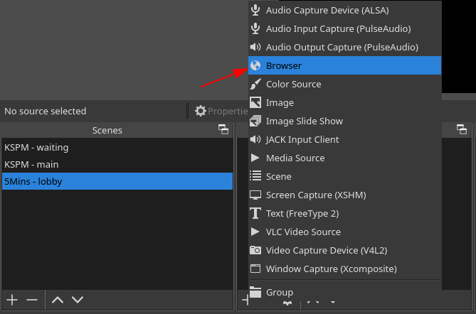
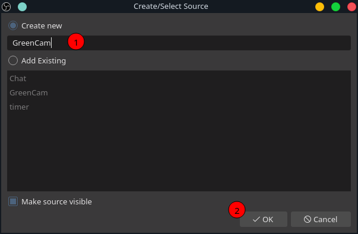
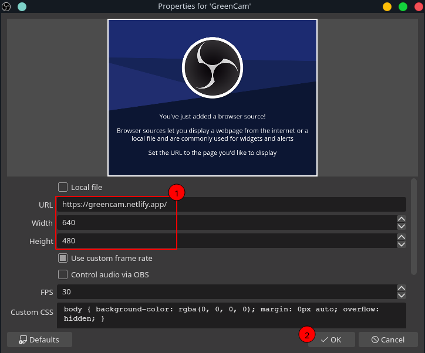

# How to load a website into OBS using Browser plugin
_(The **hard-way** but you have a good performance)_


### 1. Go to https://greencam.netlify.app
to test your PC, make sure it can run.

### 2. Add two options `--enable-gpu --enable-media-stream` to OBS starting command.

If you're using Windows, [see here](https://www.lifewire.com/command-line-parameters-video-games-3399930) how add extra parameters. Commands bellow are only for Linux.
  ```
  $ cd /usr/share/applications/
  $ ls | grep obs
  # pick the name that you see here. For me, it's `com.obsproject.Studio.desktop`

  $ sudo vi com.obsproject.Studio.desktop
  # find the line `Exec=`, modify it into the line below
  # Exec=obs --enable-gpu --enable-media-stream
  #
  # press : and "x", then press Enter to escape Vi editor
  ```

### 3. Open OBS studio, add new source from Browser plugin




### 4. In the next dialog





### 5. Right click on your new `source` - `GreenCam`


**use Key Color Type = Green**


close the dialog and DONE!!
