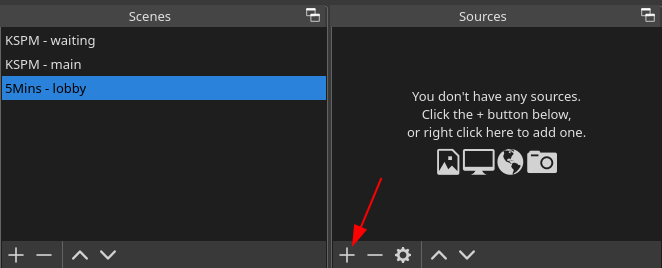
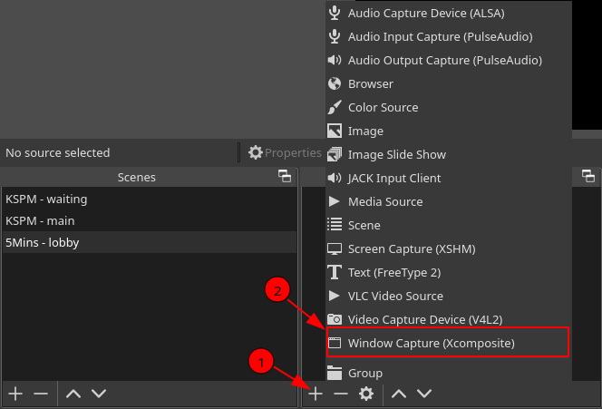
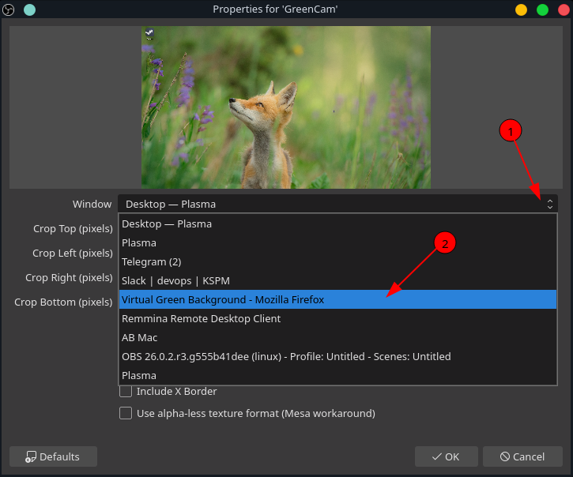
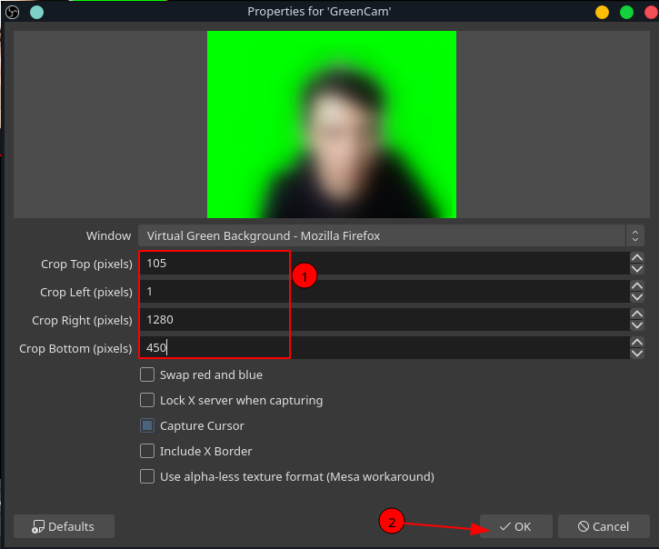
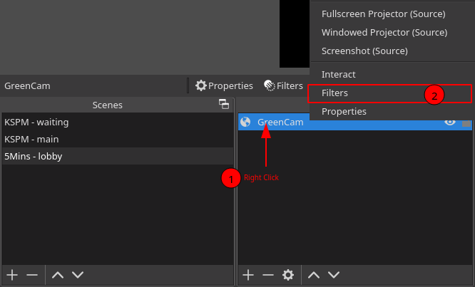
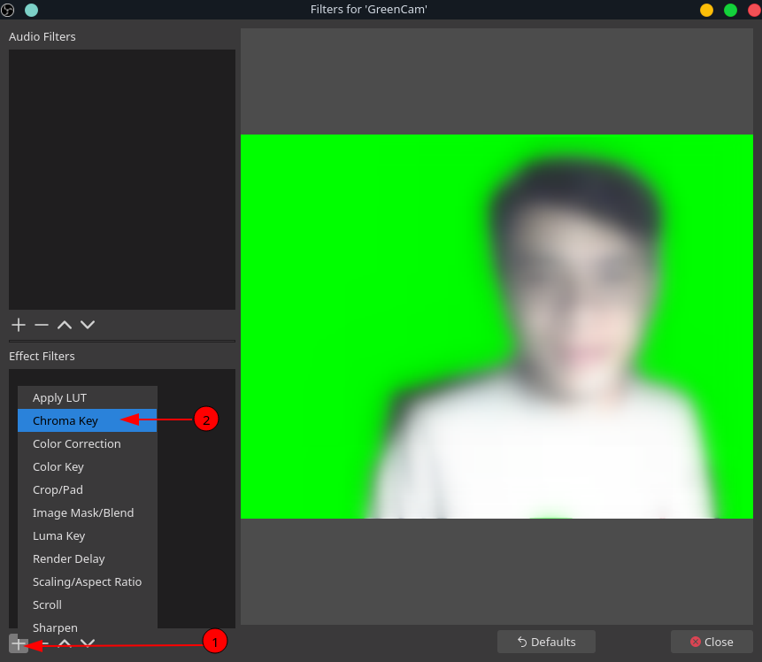
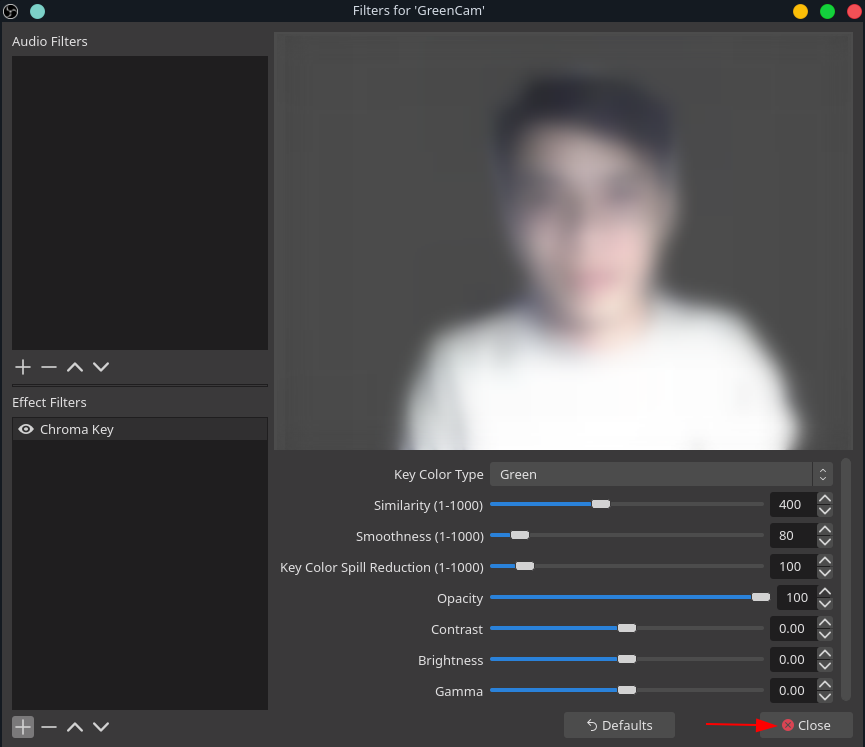

# How to use GreenCam without any extra installation
_(The easiest way - trade off with a bit flickering)_

### 1. Access GreenCam online
Access https://greencam.netlify.app using your web browser (Chrome/Safari/Firefox)

### 2. Open OBS studio, add new source from Browser plugin

### 3. In the next dialog

### 4. Right click on your new `source` - `GreenCam`

**use Key Color Type = Green**

close the dialog and DONE!!
